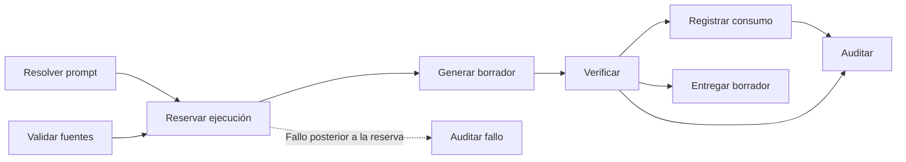

# Grafo de generación clínica

La generación documental usa un grafo dirigido pequeño y versionado. Su objetivo es hacer explícitas las dependencias reales, aislar fallos y verificar el resultado sin multiplicar llamadas al modelo ni introducir un motor genérico de workflows.

`Resolver prompt` y `Validar fuentes` no dependen entre sí y se ejecutan en paralelo. Todas las demás aristas representan una dependencia real. El nodo `generate` es el único que puede contactar a un modelo.

## Contrato de los nodos

| Nodo | Responsabilidad | Bloquea la entrega |
| --- | --- | --- |
| `resolve_prompt` | Resolver la plantilla o componer el prompt libre acotado. | Sí |
| `validate_sources` | Comprobar cantidad, tamaño, formato, firma y nombre seguro de cada archivo. | Sí |
| `reserve_execution` | Reservar cuota y concurrencia antes de contactar al proveedor. | Sí |
| `generate` | Ejecutar una sola generación con timeout y cancelación. | Sí |
| `verify` | Aplicar reglas deterministas al borrador estructurado. | Sí ante un bloqueo |
| `record_usage` | Registrar tokens y coste estimado. | No |
| `audit` | Registrar procedencia y resultado operacional. | No |
| `audit_failure` | Cerrar la traza durable cuando falla un nodo posterior a la reserva. | No |
| `deliver` | Entregar un borrador editable al profesional. | Sí |

## Verificación determinista

El verificador no es otro modelo. Comprueba estructura, secciones incompletas, contenido sin evidencia, repetición de la identidad, títulos duplicados, campos identificatorios ausentes, evidencia que no pudo contrastarse localmente y asuntos pendientes.

Los hallazgos se clasifican así:

- `warning`: el borrador sigue siendo útil, pero requiere revisión explícita.
- `block`: el resultado no cumple el contrato mínimo y no se entrega.

Las imágenes y los PDF escaneados pueden producir evidencia `unverified` cuando no existe texto local contra el cual contrastar el fragmento. Esto genera una advertencia, no una eliminación automática del contenido; la fuente continúa visible para revisión profesional.

## Trazabilidad y privacidad

Cada ejecución conserva únicamente:

- versión del workflow;
- nodo, estado y duración;
- resultado global de la verificación;
- código y cantidad de hallazgos.

La traza no contiene nombres, RUT, texto clínico, prompts ni extractos. La entrada y salida clínica permanecen bajo la trazabilidad documental ya existente y no se duplican en logs operacionales.

## Cancelación y reintento

Mientras el nodo `generate` está activo, la acción principal cambia a `Cancelar`. La señal del navegador atraviesa el stream y la reserva de ejecución hasta el proveedor; una desconexión produce el mismo cierre controlado. El estado terminal `cancelled` se conserva separado de `timed_out` y `failed`, y no se informa como una falla operacional.

Cancelar no borra fuentes, autorización ni indicaciones, por lo que el profesional puede corregir o reintentar inmediatamente. La ejecución cancelada conserva su reserva y se incluye en la cuota: evita reintentos ilimitados y refleja que el proveedor pudo haber comenzado a procesar la solicitud. La auditoría registra solo identificadores operacionales, cantidad de fuentes y traza del workflow; nunca contenido clínico.

## Límites intencionales

- Una sola llamada al modelo por borrador.
- Sin LangGraph, Neo4j ni dependencias nuevas.
- Sin reparación autónoma ni ciclos de reintento.
- Sin editor visual de nodos.
- La revisión y firma final siguen perteneciendo al profesional.

El contrato canónico vive en `app/features/ai/server/clinical-draft-workflow.ts` y sus regresiones en `tests/contracts/clinical-draft-workflow.test.ts`.
