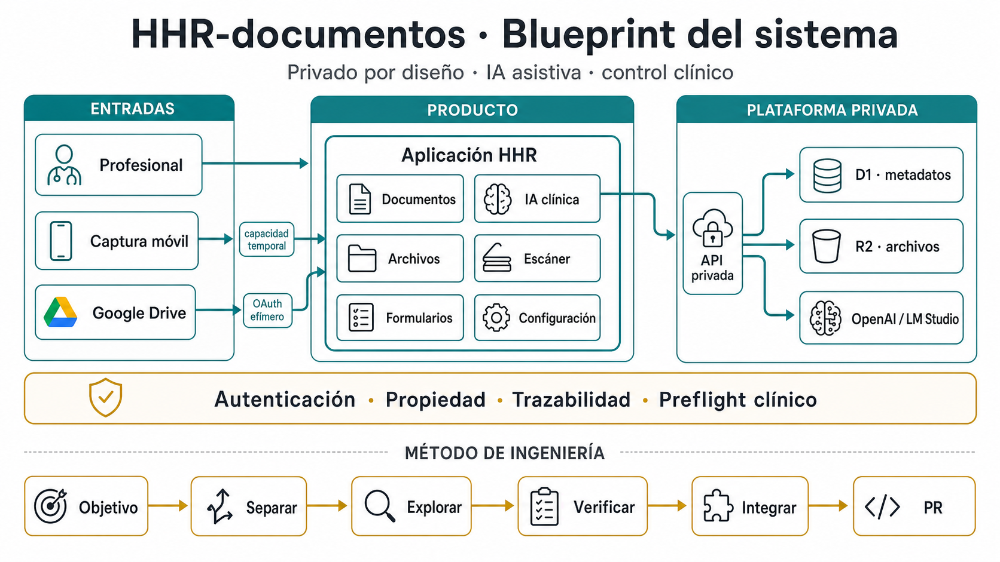
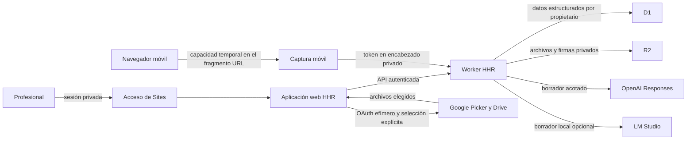
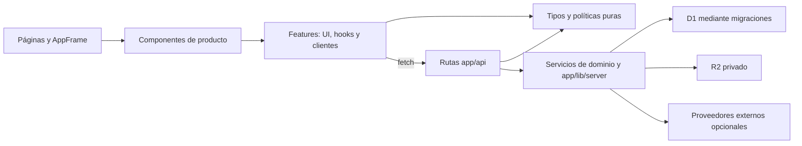
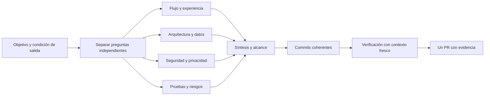

# Blueprint de arquitectura

Este documento es el mapa canónico de HHR Documentos. Describe fronteras estables,
dependencias reales y flujos que necesitan verificación explícita. El código sigue
siendo la autoridad de ejecución; el blueprint permite entender y modificar el
sistema sin reconstruir su arquitectura desde cero en cada PR.

La imagen resume la lectura ejecutiva del sistema. Su
[fuente editable en Mermaid](./assets/hhr-system-blueprint.mmd) conserva los nodos y
aristas para actualizarla junto con la arquitectura.

## Cómo usar el mapa

- Un **nodo** tiene una responsabilidad y un propietario reconocible en el repositorio.
- Una **arista** transporta una llamada, datos o un resultado que el nodo siguiente necesita.
- Una dependencia que no aparece aquí no debe añadirse por conveniencia: primero se decide
  si pertenece al diseño.
- Los grafos muestran límites y secuencias críticas, no componentes visuales menores ni
  cada función interna.

Este enfoque es deliberadamente liviano: Mermaid y Markdown dentro del repositorio,
sin motor de workflows, base de grafos ni editor visual.

## Contexto del sistema

### Límites del contexto

- Sites autentica el acceso principal; las rutas API vuelven a resolver al propietario y
  filtran cada operación por él.
- La captura móvil no transporta identidad clínica en el QR. Usa una capacidad temporal,
  revocable y separada de la navegación autenticada.
- D1 conserva estado y metadatos; R2 conserva bytes. Ningún componente de navegador accede
  directamente a esos bindings.
- OpenAI y LM Studio generan borradores. No finalizan, firman, imprimen ni persisten un
  documento por decisión propia.
- Google Drive solo entrega los archivos seleccionados. El token vive en memoria durante
  la pestaña y no se guarda en D1 ni R2.

## Capas y dependencias

| Capa | Responsabilidad | Ubicación principal |
| --- | --- | --- |
| Composición | Autenticación de la página, navegación y ensamblaje de la tarea. | `app/**/page.tsx`, `app/components/AppFrame.tsx` |
| Presentación | Interacción accesible y estado visible, sin acceso directo a infraestructura. | `app/components`, `app/features/*/*.tsx` |
| Coordinación cliente | Estado del workspace, operaciones HTTP y políticas reutilizables. | `app/features/*/use-*.ts`, `app/features/*/client.ts`, políticas puras |
| Límite HTTP | Autenticación, normalización, límites, coordinación y respuesta segura. | `app/api/**/route.ts` |
| Dominio de servidor | Persistencia, proveedores, extracción, auditoría y contratos operacionales. | `app/features/*/server`, `app/lib/server` |
| Infraestructura | Esquema, migraciones, D1, R2 y configuración de despliegue. | `db`, `drizzle`, `.openai`, bindings del runtime |

### Aristas prohibidas

1. Un módulo de navegador no importa `app/lib/server` ni un módulo `features/*/server`.
2. Un componente no consulta D1, R2 o secretos directamente.
3. Una ruta no modifica el esquema: todo DDL pertenece a una migración versionada.
4. Un proveedor de IA no guarda documentos ni decide estados clínicos.
5. Una integración externa no escribe de regreso en un sistema clínico.
6. Un error operacional no registra nombres, RUT, prompts, extractos ni texto clínico.

## Propiedad por dominio

| Dominio | Posee | No posee |
| --- | --- | --- |
| Documentos | Edición, identidad estructurada, persistencia, versiones, firma, preflight e impresión. | Extracción de fuentes y ejecución de modelos. |
| IA | Fuentes, prompts, proveedores, generación, evidencia, consumo y trazabilidad del borrador. | Firma, finalización o impresión automática. |
| Archivos | Metadatos, ciclo de vida de objetos, propiedad, descarga y eliminación. | Edición clínica del contenido. |
| Escáner y captura | Transformación local de imágenes, PDF, sesiones móviles y recepción temporal. | Persistencia directa fuera del dominio Archivos. |
| Formularios | Preservación y composición de documentos institucionales. | Rediseño arbitrario de sus elementos oficiales. |
| Configuración e integraciones | Preferencias operacionales y acceso puntual a servicios externos. | Persistencia de tokens OAuth o escritura externa. |
| Plataforma | Autenticación, entorno, base de datos, auditoría, errores y migraciones. | Decisiones visuales o clínicas de cada feature. |

### Autoridad de trazas de IA

Cada dato operacional tiene un solo propietario: `ai_operation_runs` controla reserva,
cuota y estado; `ai_usage_events` contabiliza consumo; `audit_events` registra el resultado
terminal con conteos acotados. Los nombres de fuentes, prompts, evidencia y contenido del
borrador pertenecen exclusivamente al documento aislado por propietario. No existe una
segunda bitácora de importaciones ni se copian nombres de archivo a la auditoría operacional.

## Registro de flujos críticos

| Flujo | Contrato canónico | Estado terminal esperado |
| --- | --- | --- |
| Generación clínica con IA | [Grafo de generación clínica](./AI_CLINICAL_DRAFT_WORKFLOW.md) | Borrador verificado o bloqueo auditado. |
| Edición, impresión e historial | [Ciclo de vida de documentos](./DOCUMENT_LIFECYCLE.md) | Documento persistido, impresión autorizada o corrección enfocada. |
| Escáner y captura móvil | [Escáner y captura móvil](./SCANNER_CAPTURE_WORKFLOW.md) | Salida local o archivo privado publicado sin residuos parciales. |
| Migración y recuperación de D1 | [Migraciones de base de datos](./DATABASE_MIGRATIONS.md) | Esquema íntegro o rollback comprobable. |
| Errores operacionales | [Diagnóstico de errores](./ERROR_DIAGNOSTICS.md) | Respuesta segura con código de soporte. |
| Google Drive | [Integración con Google Drive](./GOOGLE_DRIVE.md) | Archivos elegidos en memoria o cancelación sin persistencia. |

Un flujo se agrega a este registro cuando combina al menos dos de estas condiciones:
datos clínicos, efectos externos, concurrencia, recuperación, estados terminales distintos
o un bloqueo de seguridad.

## Grafo de ingeniería de un cambio

No todos los cambios necesitan cuatro ramas de análisis. Para un ajuste pequeño, varios
nodos pueden colapsarse. La disciplina mínima es conservar objetivo, dependencias,
resultado verificable y fuera de alcance. El
[ratchet de ingeniería verificable](./ENGINEERING_RATCHET.md) define cuándo basta un cambio
directo o PR convencional y cuándo se justifica un bucle, una cadena, un enrutador,
paralelismo limitado, un DAG de commits o ramas, o un grafo de conocimiento acotado, sin
añadir complejidad por defecto.

La [plantilla de pull request](../.github/pull_request_template.md) materializa esa
disciplina con cuatro secciones breves. No exige completar nodos artificiales ni reemplaza
la descripción técnica específica de cada PR.

## Cuándo actualizar este blueprint

Se actualiza en el mismo PR que:

- introduce o elimina un sistema externo, almacén o frontera de autenticación;
- crea una dependencia nueva entre dominios;
- cambia el propietario de datos o de un efecto lateral;
- altera un flujo crítico, sus bloqueos o sus estados terminales;
- cambia una arista permitida o prohibida.

No requiere actualización un cambio visual, textual o una refactorización interna que
conserve las mismas fronteras y contratos.
