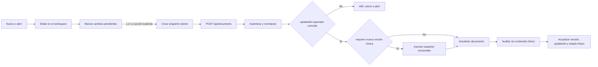
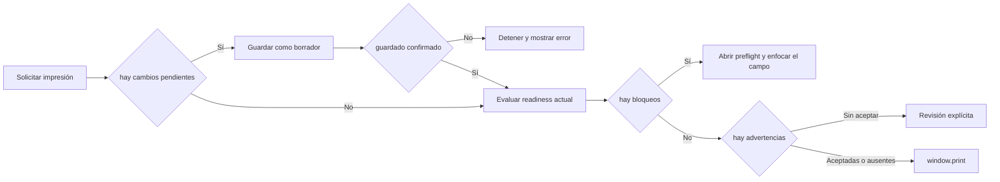
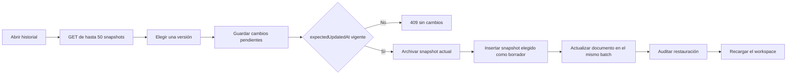

# Ciclo de vida de documentos

Este flujo conecta el editor visible con la persistencia, el preflight de impresión y el
historial. Su objetivo es evitar tres fallos: perder ediciones, imprimir un documento
clínicamente incompleto o sobrescribir cambios de otra pestaña.

## Propiedad

- Composición: `app/components/DocumentStudio.tsx`.
- Estado y coordinación: `app/features/documents/use-document-workspace.ts`.
- Persistencia cliente: `app/features/documents/use-document-persistence.ts`.
- Reglas puras: `app/features/documents/document-policy.ts` y
  `app/features/documents/document-readiness.ts`.
- Límite HTTP: `app/api/documents/route.ts` y
  `app/api/documents/[id]/versions/route.ts`.
- Estado durable: tablas `documents`, `document_versions` y `audit_events` en D1.

## Edición y guardado

### Reglas

1. Solo existe una promesa de guardado activa por workspace; una segunda acción reutiliza
   esa operación.
2. El autosave conserva el estado `Borrador` y se programa 1,2 segundos después de una
   edición.
3. Cada escritura de un documento existente envía `expectedUpdatedAt`. Una diferencia
   devuelve `409` y no sobrescribe la versión remota.
4. Un documento nuevo crea su snapshot inicial. En un documento existente, cambiar a un
   estado clínico no borrador distinto incrementa la versión.
5. La respuesta del servidor solo limpia el estado local si no hubo otra edición mientras
   el guardado estaba en curso.

## Preflight e impresión

Los bloqueos cubren identidad mínima, fecha y ausencia total de contenido clínico. Las
advertencias permiten imprimir solo después de una decisión explícita y dirigen al control
exacto que debe revisarse. La impresión nunca intenta reparar datos ni cambiar el estado
clínico del documento.

## Historial y restauración

La restauración es no destructiva: conserva la punta anterior, crea una versión nueva y
devuelve el contenido recuperado al estado `Borrador`. Las tres escrituras quedan protegidas
por el mismo `expectedUpdatedAt`.

## Condiciones terminales

| Operación | Éxito | Fallo seguro |
| --- | --- | --- |
| Guardado | D1 confirma documento, versión y `updatedAt`. | El workspace sigue sucio y ofrece recarga si hubo conflicto. |
| Impresión | No quedan cambios pendientes ni bloqueos; advertencias aceptadas. | No se abre el diálogo de impresión y se enfoca el problema. |
| Restauración | Punta anterior archivada y copia restaurada como borrador. | Ninguna versión se sobrescribe ante conflicto o snapshot inválido. |
