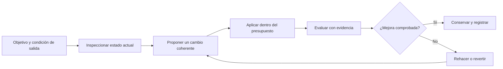

# Ratchet de ingeniería verificable

Este documento adapta el enfoque de *Graph Engineering* al tamaño y a los riesgos reales
de HHR Documentos. No convierte el proyecto en un sistema multiagente ni exige dibujar un
grafo para cada tarea. Su propósito es escoger la estructura más simple que haga visibles
las dependencias, permita medir el resultado y deje una reversión clara.

## Regla principal

> Empezar con el flujo lineal más pequeño. Añadir ramas, evaluadores, persistencia o
> paralelismo solo cuando exista un cuello de botella observable que esa estructura resuelva.

La unidad de progreso es un cambio verificable, no la cantidad de nodos, herramientas o
agentes utilizados.

## Elegir el patrón antes de construir

| Pregunta | Si la respuesta es sí | Patrón mínimo |
| --- | --- | --- |
| ¿Debe repetirse el cambio hasta mejorar una métrica? | La mejora requiere alternar aplicación y evaluación más de una vez. | Bucle evaluar y conservar/revertir. |
| ¿Los pasos tienen un orden estable? | Las dependencias no cambian entre ejecuciones. | Cadena explícita. |
| ¿Hay categorías con tratamientos distintos? | Una entrada debe elegir una ruta acotada. | Enrutador. |
| ¿Hay tareas realmente independientes? | No comparten estado mutable ni dependen entre sí. | Paralelismo limitado. |
| ¿Deben conservarse alternativas de trabajo? | Es útil comparar o recuperar experimentos. | DAG de commits o ramas. |
| ¿Las relaciones deben sobrevivir al proceso actual? | Se consultarán hechos conectados en otros flujos. | Grafo de conocimiento acotado. |

Poder medir el resultado no exige por sí solo un bucle: una puerta determinista también puede
validar un cambio directo o una cadena de una sola pasada. Si ninguna condición justifica
estructura adicional, se usa una función, una cadena o un PR convencional.

### Lo que no debe confundirse

- El **DAG de Git** conserva la historia del trabajo: propuesta, cambio, evaluación y decisión.
- Un **grafo de conocimiento** conserva hechos del dominio, relaciones y procedencia.

HHR Documentos usa Git y documentos de arquitectura para la primera necesidad. No necesita
una base de grafos para representar documentos, firmas o plantillas: sus relaciones actuales
son acotadas y relacionales.

## Bucle de cambio

1. **Objetivo:** una frase y una condición de salida observable.
2. **Inspección:** estado real de código, datos, interfaz, pruebas y despliegue afectado.
3. **Propuesta:** una hipótesis de mejora y el patrón mínimo que necesita.
4. **Aplicación:** superficies mutables y protegidas declaradas antes de editar.
5. **Evaluación:** comparación contra el estado inicial, con pruebas deterministas cuando
   sea posible y revisión humana cuando el resultado sea visual o clínico.
6. **Decisión:** conservar, rehacer o revertir; no ocultar un resultado neutro o negativo.
7. **Registro:** commits y PR transportan la evidencia y el motivo de la decisión.

## Presupuesto de complejidad

Cada cambio declara solo los límites que le correspondan:

- archivos o dominios que puede modificar y los que debe proteger;
- dependencias nuevas permitidas (por defecto, ninguna);
- llamadas a modelos y reintentos permitidos;
- trabajo paralelo y concurrencia máxima;
- tiempo, tamaño de bundle o coste operacional relevante;
- efectos externos y forma de revertirlos;
- evidencia mínima para aceptar el resultado.

Un presupuesto vacío no significa ejecución ilimitada: conserva los límites actuales del
repositorio. Superar un límite exige una decisión explícita, no cambiar silenciosamente la
puerta de calidad.

### Fronteras de carga verificables

El presupuesto web se mide desde el manifiesto de producción, no suponiendo que cada ruta
carga todos los estilos generados. El shell comparte solo el CSS sin propietario explícito;
cada entrada suma sus importaciones estáticas y sus hojas asociadas. Las herramientas
opcionales conservan un presupuesto diferido separado y no pueden reaparecer en la carga
inicial de su módulo.

Para Documentos esto implica tres contratos automáticos:

- sus estilos pertenecen a la entrada de `DocumentStudio` y no a la raíz de la aplicación;
- el asistente IA y la configuración avanzada de plantillas siguen siendo importaciones
  dinámicas;
- el total de artefactos no aumenta su límite para acomodar una nueva separación.

## Aplicación al producto

HHR Documentos separa cinco planos sin mostrarlos como complejidad al usuario:

| Plano | En este producto | Regla de diseño |
| --- | --- | --- |
| Control | Objetivo, política clínica y límites de ejecución. | Vive en contratos y configuración; no ocupa la tarea principal. |
| Ejecución | API, proveedores, extracción y flujos versionados. | Estados acotados, cancelación y un único propietario por efecto. |
| Artefacto | Documento, PDF, formulario, imagen o archivo. | Es el centro visible de la experiencia. |
| Grafo | Dependencias y procedencia de flujos críticos. | Se muestra solo cuando ayuda a revisar o diagnosticar. |
| Evaluación | Verificadores, preflight, pruebas y revisión profesional. | Bloqueos accionables; advertencias aceptables de forma explícita. |

### IA clínica

El grafo clínico actual ya aplica el patrón adecuado: preparación independiente de prompt y
fuentes, una sola llamada al modelo, verificación determinista y entrega editable. El diseño
visible traduce ese grafo a lenguaje de tarea:

- durante la ejecución, muestra una progresión breve: preparar, leer, identificar, redactar
  y verificar;
- al guardarse, conserva el resultado de verificación y las advertencias dentro de la
  trazabilidad plegada;
- la procedencia detallada permanece plegada y disponible para revisión;
- como requisito verificable, la traza operacional se limita a nodo, estado y duración; las
  [pruebas del grafo clínico](../tests/contracts/clinical-draft-workflow.test.ts) impiden que
  incorpore valores clínicos;
- los registros operacionales se limitan a metadatos permitidos; el
  [contrato de metadata operacional](../tests/contracts/ai-operational-metadata.test.ts), las
  [pruebas del contrato HTTP](../tests/contracts/http-errors.test.ts) y las
  [pruebas de migración](../tests/database/migrations.test.mjs) impiden que nombres, RUT,
  prompts y detalles privados lleguen al log o permanezcan en una bitácora redundante.

No se añade reparación autónoma, un enjambre de agentes ni un editor visual. La revisión y
la firma continúan siendo responsabilidad del profesional.

## Invariante de producción

Una salida importante debe poder relacionarse, en la medida que corresponda, con:

1. el objetivo que la originó;
2. el plan o contrato aplicado;
3. el artefacto producido;
4. las fuentes permitidas;
5. la evaluación que autorizó conservarla o entregarla;
6. un registro operacional acotado y seguro.

La trazabilidad no autoriza duplicar datos clínicos en logs ni conservar contexto completo
cuando basta una referencia, un código o un conteo.

## Señales para detener la complejidad

Se conserva el diseño actual cuando una propuesta:

- añade un grafo sin consultas reales entre relaciones;
- divide trabajo estrechamente acoplado entre varios agentes;
- usa otro modelo para comprobar algo que puede verificar código determinista;
- guarda transcripciones completas en lugar de contexto conectado y acotado;
- incorpora una dependencia para un único flujo estable;
- aumenta coste, latencia o superficie visual sin mejorar una condición de salida.

## Referencias contrastadas

- [Karpathy, `autoresearch`](https://github.com/karpathy/autoresearch): bucle acotado,
  evaluación objetiva y decisión conservar/descartar.
- [Anthropic, Building effective agents](https://www.anthropic.com/engineering/building-effective-agents):
  patrones componibles y complejidad añadida solo cuando mejora el resultado.
- [Anthropic, Demystifying evals for AI agents](https://www.anthropic.com/engineering/demystifying-evals-for-ai-agents):
  evaluación durante el ciclo de vida del sistema.
