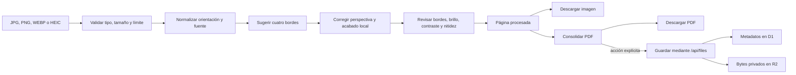

# Escáner y captura móvil

El escáner tiene dos entradas con un mismo destino opcional: la biblioteca privada de
Archivos. Las imágenes importadas desde el equipo se transforman localmente; la captura
móvil usa una capacidad temporal y un protocolo de publicación D1/R2 recuperable.

## Propiedad

- Workspace: `app/components/ScannerDesk.tsx`.
- Importación local: `app/features/scanner/DesktopImageScanner.tsx`.
- Bordes y calidad: `app/features/scanner/ScanReviewEditor.tsx`,
  `app/features/scanner/document-detection.ts` y `app/lib/scan-processing.ts`.
- PDF cliente: `app/lib/client-pdf.ts`.
- Sesiones: `app/api/mobile-sessions/route.ts`.
- Recepción móvil: `app/api/mobile-upload/route.ts`.
- Persistencia final: dominio Archivos mediante `app/features/files/client.ts` y
  `app/api/files/route.ts`.

## Imágenes del equipo

### Reglas

1. Hasta 12 imágenes y 15 MB por fuente; un PDF guardado también debe caber en 15 MB.
2. El original normalizado permanece disponible para reprocesar una página sin encadenar
   pérdidas sobre la salida anterior.
3. Detección, perspectiva, filtros y PDF ocurren en el navegador. Nada se sube por importar,
   editar o descargar.
4. Guardar es una acción separada y usa el contrato del dominio Archivos; el escáner no
   escribe D1 ni R2 directamente.
5. Si una transformación falla, la página anterior se conserva.

## Captura móvil

```mermaid
flowchart LR
    Owner["Navegador autenticado"] --> Create["Crear sesión"]
    Create --> Revoke["Revocar sesiones activas anteriores"]
    Revoke --> Session["Guardar hash, expiración y auditoría en D1"]
    Session --> QR["Entregar token una vez dentro del fragmento QR"]
    QR --> Mobile["Navegador móvil"]
    Mobile -->|"token en x-hhr-capture-token"| Validate["Validar sesión y capacidad"]
    Validate --> Reserve["Reservar archivo pendiente en D1"]
    Reserve --> Put["Escribir bytes en R2"]
    Put --> Publish["Activar archivo y auditar en D1"]
    Publish --> Poll["Consulta autenticada por id de sesión"]
    Poll --> Received["Mostrar archivo recibido"]

    Put -. "fallo" .-> Cleanup["Eliminar objeto y reserva pendiente"]
    Publish -. "sesión cerrada" .-> Cleanup
```

### Reglas

1. Cada propietario tiene como máximo una sesión activa; crear otra revoca la anterior en
   el mismo batch.
2. El token aleatorio dura 10 minutos, se almacena solo como hash y no viaja en la ruta HTTP
   del QR.
3. La capacidad permite hasta 8 archivos y se reserva en D1 antes de escribir en R2.
4. `x-hhr-upload-id` hace idempotente el reintento cuando la respuesta anterior se pierde.
5. Un archivo solo se publica cuando R2 existe, la sesión sigue activa y la transición
   `pendiente → activo` queda auditada.
6. El navegador autenticado consulta únicamente sesiones y archivos de su propietario; el
   móvil conoce la capacidad, no la identidad del propietario.

## Condiciones terminales

| Camino | Éxito | Fallo seguro |
| --- | --- | --- |
| Importación local | Imagen o PDF descargado, o archivo privado guardado por decisión explícita. | Se conserva la fuente y no aparece un registro remoto parcial. |
| Captura móvil | Archivo `activo` en D1, objeto en R2 y evento de auditoría. | Reserva/objeto descartados, o respuesta estable de expiración, capacidad o reintento. |
| Cierre de sesión | Estado revocado o expirado y última vista serializada para el propietario. | Una carga posterior es rechazada aunque conserve el token anterior. |
